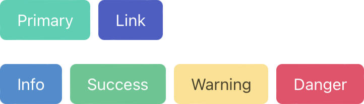

# IMS322 CSS Mini-Framework
A CSS framework (e.g. [Tailwind CSS](https://tailwindcss.com) or [Bulma](https://bulma.io)) is a collection of several stylesheets (`.css` files) with predefined styles for page layouts, inputs and controls, fonts, color palettes, navigation, and more.

While CSS frameworks can save time and effort for busy web developers, they are usually very "opinionated," meaning that they dictate much of the overall aesthetic and layout of sites. This isn't necessarily a bad thing, but it does mean that it can require additional effort to ensure that your project does not look too much like others built using the same utility. Additionally, it is beneficial to have a good grasp on CSS fundamentals before adopting a framework.

	<figure style="width: 361px">
		
		<figcaption style="font-style: italic; text-align: center;">Button styles in Bulma</figcaption>
	</figure>

Each Replit template for this class will include a very basic and minimal IMS322 CSS mini-framework consisting of a single `ims322-style.css` stylesheet. The predefined style properties in our mini-framework are nowhere near as complete or sophisticated as what you would normally find in a mainstream CSS framework. Rather, they are intended as a small tool to help save time and prevent minor headaches - and avoid some of my style pet peeves!
## IMS322 Body Element
The body element is given a small amount of padding that adjusts slightly with different window widths. It is also given flexbox properties to center all content horizontally. By default, all child elements of the `<body>` are limited to maximum width of `1100px`.
<iframe src="https://replit.com/@sheffie/IMS322-Body?embed=true" width="100%" height="480" style="border: none; border-radius: 8px; box-shadow: 0 1px 3px rgba(0,0,0,0.12), 0 1px 2px rgba(0,0,0,0.24);"></iframe>
## IMS322 Flex Row and Column
The `ims322-flex-row` class is a flexbox with the following properties:
- `justify-content: center` Centers all flex items horizontally.
- `align-items: center` - Centers all flex items vertically.
- `gap: 1ch` - Applies a small gap between flex items.

The `ims322-flex-column` class does all of the above but also adds the `flex-direction: column` property.
<iframe src="https://replit.com/@sheffie/IMS322-Flex-Row-Column?embed=true" width="100%" height="480" style="border: none; border-radius: 8px; box-shadow: 0 1px 3px rgba(0,0,0,0.12), 0 1px 2px rgba(0,0,0,0.24);"></iframe>
## IMS322 Images
All `` elements have their width set to 100% by default. This ensures that the image always fills its parent element horizontally. Height is set automatically in accordance with the image's original aspect ratio. Additionally, the default margin has been removed from `<figure>` elements to avoid any layout or spacing confusion when they are used as the parent of an ``. *Remember, the recommendation in the [IMS322 Style Guide](docs/general/style-guide) is to always put `` elements inside of a `
` or `<figure>` element.*
<iframe src="https://replit.com/@sheffie/IMS322-Images?embed=true" width="100%" height="480" style="border: none; border-radius: 8px; box-shadow: 0 1px 3px rgba(0,0,0,0.12), 0 1px 2px rgba(0,0,0,0.24);"></iframe>
## Overriding Default IMS322 Styles
Any of the styles defined in `ims322-styles.css` can be overridden by adding additional class selectors and properties to `style.css`. There are two recommended ways to do so:
- Put a selector in `style.css` with the same name as its counterpart in `ims322-style.css`.
- Make a class selector with a new name in `style.css` and apply it as a second class attribute to the relevant HTML element alongside the existing class from `ims322-style.css`.

In both scenarios, any properties changed on the selector in `style.css` will be added to or overwrite those already in `ims322-style.css`.

Media queries can also be customized if needed by adding them to `style.css`.
<iframe src="https://replit.com/@sheffie/IMS322-Overrides?embed=true" width="100%" height="480" style="border: none; border-radius: 8px; box-shadow: 0 1px 3px rgba(0,0,0,0.12), 0 1px 2px rgba(0,0,0,0.24);"></iframe>