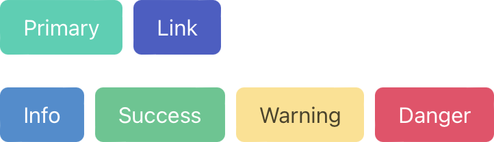

# IMS322 CSS Mini-Framework

A CSS framework (e.g. [Tailwind CSS](https://tailwindcss.com) or [Bulma](https://bulma.io)) is a collection of several stylesheets with predefined styles for page layouts, inputs and controls, fonts, color palettes, navigation, and more.

While CSS frameworks can save time and effort for busy web developers, they are usually very "opinionated," meaning that they may influence the overall aesthetic and form of sites and projects. This isn't necessarily a bad thing, but it does mean that it can require additional effort to ensure that your project does not look the same as others built using the same utility. Additionally, it is beneficial to have a good grasp on CSS fundamentals before adopting a framework.

<figure style="width: 361px">
	
	<figcaption style="font-style: italic;">Button styles in Bulma</figcaption>
</figure>

Each Replit template for this class will include a very basic and minimal IMS322 CSS mini-framework consisting of a single `ims322-style.css` stylesheet. The predefined style properties in our mini-framework are nowhere near as complete or sophisticated as what you would normally find in a mainstream CSS framework. Rather, they are intended as a tool to help save time and prevent minor headaches - and avoid some of my style pet peeves!

## IMS322 Body Element

The body element is given a small amount of padding that adjusts slightly with different window widths. It will also center and apply a maximum width of `960px` to all child elements.

<iframe src="https://replit.com/@sheffie/IMS322-Flex-Row-1?embed=true" width="100%" height="480" style="border: none; border-radius: 8px; box-shadow: 0 1px 3px rgba(0,0,0,0.12), 0 1px 2px rgba(0,0,0,0.24);"></iframe>

<iframe src="https://replit.com/@sheffie/IMS322-Flex-Row-2?embed=true" width="100%" height="480" style="border: none; border-radius: 8px; box-shadow: 0 1px 3px rgba(0,0,0,0.12), 0 1px 2px rgba(0,0,0,0.24);"></iframe>

<iframe src="https://replit.com/@sheffie/IMS322-Flex-Images?embed=true" width="100%" height="480" style="border: none; border-radius: 8px; box-shadow: 0 1px 3px rgba(0,0,0,0.12), 0 1px 2px rgba(0,0,0,0.24);"></iframe>