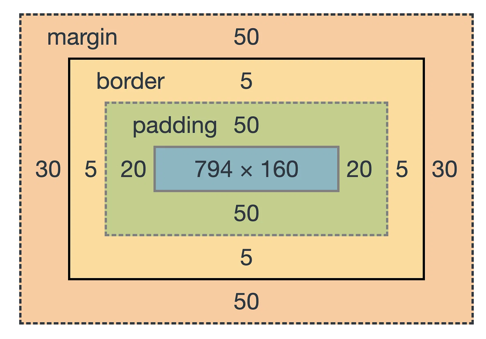
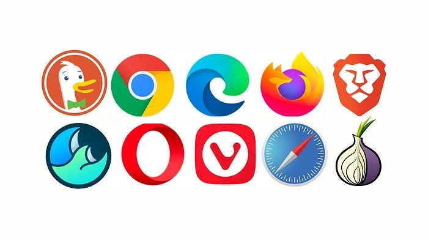

# Review
Before we start working with JavaScript, this class assumes some familiarity with the HTML, CSS, and general web browser concepts below. If you are unfamiliar with one or more of these, fear not! We will be starting the semester with a survey to assess the class' collective knowledge and set aside some time in class for review.
## HTML
### Basic tags/elements 
Excerpted from Kevin Powell's ["The Only Tags You Need to Know (for now)"](the-only-tags-that-you-need-to-know-for-now.pdf)
- Metadata tags: `<head>` `<title>` `<link>` `<body>`
- Content tags: `<h1>`...`<h6>` `<p>` `<a>` `<ol>` `<ul>` `<li>` ``
- Layout tags: `<header>` `<main>` `<footer>` `<nav>` `<section>` `<div>`

### Attributes
- alt: alternate text for an `` tag
- class: for use as a selector in CSS
- href: url for `<a>` tags
- id: for use as a query in JavaScript
- src: path to image to be displayed for `` tags

## CSS
### Flexbox
Flexbox is used to create responsive layouts. It is typically best for 1-dimensional rows or columns, though slightly more complex layouts can be achieved by putting one flexbox inside another.
<div style="display: flex; justify-content: space-evenly; gap: 1ch;">
	<figure style="max-width: 350px">
		
	</figure>
	<figure style="max-width: 350px">
		
	</figure>
</div>
### Relative units
Recommended relative units from the [IMS322 Style Guide](style-guide):
- `%` - Percentage relative to the parent element. 
- `ch` - The width of the number "0" of the element's font.
- `rem`	- Relative to the default browser font size.
- `vw` - 1% of the viewport's (window) width.
- `vh` - 1% of the viewport's (window) height.

### Media Queries
Media queries allow you to apply CSS styles depending on a device's screen resolution. Typically used for describing the desired changes to layout and/or size properties between mobile and desktop displays.
```css
@media screen and (max-width: 480px) {
  .ims322-flex-row {
    flex-direction: column;
  }
}
```
### CSS variables
CSS variables (aka custom properties) can be used to define a custom value that is reused throughout a document. They are very helpful towards enforcing consistency and make it easier to try variations when multiple elements reference the same value.
```css
:root {
  --miami-red: #C41230;
}
```
### Box Model
The CSS Box Model describes how margin, border, padding, and content relate to each other in an HTML element.
<div style="display: flex; justify-content: center;"> 
  <figure style="max-width: 500px;">
	  
  </figure>
</div>
### :hover pseudo-class
The `:hover` pseudo-class is used to define style properties to be applied when a user hovers over an element.
```css
a:hover {
  color: #FF00FF;
}
```
### Transition times
Transition time sets a duration over which style changes occur gradually e.g. changing color on a button when hovered over.
```css
.primary-button {
  transition: all 1s;
}
```
or
```css
.primary-button {
  transition-duration: 1s;
}
```
## Web Browsers
### Browser options
What web browsers are most commonly used? Why might someone choose one over another? Who are the developers of these browsers?
<div style="display: flex; justify-content: center;"> 
  <figure style="max-width: 350px;">
	  
  </figure>
</div>
### Developer Tools
Where are the Developer Tools in your browser? What is their purpose? How can they help you with your projects?
### Responsive Design Mode
Where is the Responsive Design Mode in your browser? How does it work? What is it used for?