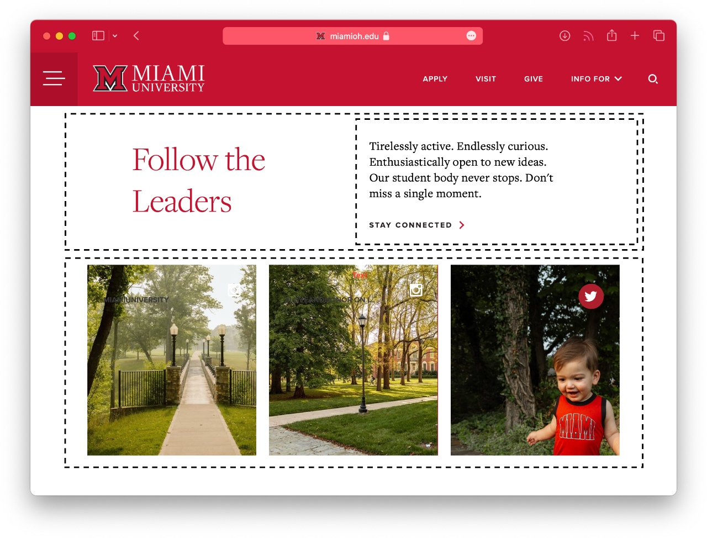

# DRAFT
# IMS322 Style Guide

A coding style guide contains a set of rules and guidelines for writing code. Many organizations, large and small (e.g. Google, Airbnb, and more), adopt style guides to ensure that everyone adopts a similar style. Sloppy or inconsistent code might still technically work, but it can be difficult to read, share, or debug.

You can think of a coding style guide kind of like a writing style guide that you might have used before when working on a research paper, like Chicago or MLA. These style guides aren't meant to address content so much as formatting and usage, which ensures legibility and consistency.

This **IMS322 Style Guide** has been compiled from a collection of reputable sources to help address the styling issues most relevant to this class. You should reference this guide regularly whenever working on exercises or assignments until it becomes second nature. Although there are some widely adopted conventions in this guide, it is by no means intended to be the "best" or "correct" approach — after taking this class, you might consider other coding styles based on personal or professional preference.

---
## General
### Use lowercase file names
As in `index.html`, NOT `Index.html` or `INDEX.html`.
### Default filenames
Use the following default filenames in your projects:
- `index.html`
- `style.css`
- `script.js`

If you need more files (e.g. multiple CSS files), it is acceptable to use other unique and descriptive names like `footer-style.css`. In fact, each Replit template in this class will include an `ims322-style.css` file in addition to the standard `style.css` file. You can read more about the purpose of `ims322-style.css` [here](css-framework).
### Simplify image names
Rename image files for clarity and simplicity whenever necessary. For example, `dog.jpg` is much easier to type and identify than `neom-9E9NsEiUGxg-unsplash.jpg` or `IMG_1234.JPG`.
### Media queries and display size targets
We will be using the following screen widths for all projects (based on [MDN Web Docs recommendations](https://developer.mozilla.org/en-US/docs/MDN/Writing_guidelines/Writing_style_guide/Code_style_guide/CSS#mobile-first_media_queries)):
- 480px (mobile)
- 800px (tablet, narrow laptop/desktop windows)
- 1100px (wide laptop/desktop windows)

These sizes are already pre-configured for you in the `ims322-style.css` file through media queries (for `480px` and `800px`) and the `body *` selector (for `1100px`, which applies to all children of the `<body>` element).
### Image sizes
Ensure that all image files used in your projects are reasonably sized (not too large, not too small) according to their intended use.

Modern high-DPI (dots per inch) displays actually scale content to provide sharper image quality when content is designed appropriately. For example, a website with a width of `800px` on a 13" MacBook Air actually fills `1600px` of the display — it uses 4 physical pixels (2 in width, 2 in height) to render every 1 pixel of content. If you have a 4K TV at home (3840 x 2160), a similar process occurs when it is upscaling 1920 x 1080 content (which is HD, but not 4K).

You should consider how much of the browser window your images will cover (in pixels), and then *double that value* when cropping or downloading image files. For example, an image that will only take up half of the browser window at the most (e.g. one side of a two-column layout, `550px` of window space) should have an original width of approximately `1100px`. When downloading images from [Unsplash](https://unsplash.com), the most appropriate size for your layout will often be the small or medium option.

To illustrate, the two images below are each inside of `<figure>` elements that have the property `max-width: 320px`. Even though they look identical, the one on the left has a much smaller original resolution and file size, which can result in faster loading times.
<div style="display: flex; justify-content: space-evenly; gap: 1ch;">
	<figure style="max-width: 320px">
		
		<figcaption style="font-style: italic;">640X960 original resolution (223KB)</figcaption>
	</figure>
	<figure style="max-width: 320px">
		
		<figcaption style="font-style: italic;">2400X3600 original resolution (2MB)</figcaption>
	</figure>
</div>
### Image containers and aspect ratios
It is highly recommended to wrap all images in a `<figure>` element. This will generally make it much easier to attain the desired image size and position within your layout without distorting the aspect ratio. All `` elements have the `width: 100%` property applied by default in `ims322-style.css`, which means that they will automatically take on the width of their parent container without becoming stretched or squished. As an added bonus, the `<figcaption>` element can be used inside of a `<figure>` element to easily add captions to your images if desired.
#### Example HTML
```html
<figure class="ostrich-container">
  
  <figcaption>An ostrich, yeah?</figcaption>
</figure>
```
#### Example CSS
```css
img {
  width: 100%;
}

.ostrich-container {
  max-width: 320px;
}
```
#### Results
<figure style="max-width: 320px;">
  
  <figcaption style="font-style: italic;">An ostrich, yeah?</figcaption>
</figure>
---
## HTML
Excerpted from [W3 Schools](https://www.w3schools.com/html/html5_syntax.asp) and [MDN Web Docs](https://developer.mozilla.org/en-US/docs/MDN/Writing_guidelines/Writing_style_guide/Code_style_guide/HTML).
### Use lowercase element names
#### This:
```html
<div>
  <p>This is a paragraph.</p>
</div>
```
#### Not this:
```html
<DIV>
  <P>This is a paragraph.</P>
</DIV>
```
### Do not use spaces around equals signs
#### This:
```html

```
#### Not this:
```html

```
### Organize HTML with blank lines, indentation, and comments
#### This:
```html
<body>

  <header>
	<h1>My Big Project</h1>
  </header>

  <main>
	<!-- This is an HTML comment. -->
	<p>Tons of great content here.</p>
  </main>

  <footer>
    <p>Did you like my content?</p>
  </footer>

</body>
```
#### Not this:
```html
<body>
<header>
<h1>My Big Project</h1>
</header>
<main>
<!-- This is an HTML comment. -->
<p>Tons of great content here.</p>
</main>
<footer>
<p>Did you like my content?</p>
</footer>
</body>
```
### Ensure there is always only one of each `<html>`, `<head>`, `<title>`, and `<body>` elements
The template in Replit will automatically include one of each of these elements for you. Be careful not to accidentally duplicate or break these elements when editing or copy-pasting.
```html
<!DOCTYPE html>
<html>

<head>
  <meta charset="utf-8">
  <meta name="viewport" content="width=device-width, initial-scale=1.0">
  <title>IMS322 Template</title>
  <link href="ims322-style.css" rel="stylesheet" type="text/css" />
  <link href="style.css" rel="stylesheet" type="text/css" />
  <script src="script.js" defer></script>
</head>

<body>
  <p>Stuff stuff stuff.</p>
</body>

</html>
```
### Naming classes and IDs
Class and ID attributes should always be written using the the *kebab-case* convention in which lowercase words are separated by hyphens.
```html
<p class="kebab-case-class" id="kebab-case-id">Blah blah blah.</p>
```
Write concise, searchable, and meaningful names. Only use common and easy-to remember abbreviations if a name becomes excessively long.
### Use semantic HTML
A [semantic HTML](https://developer.mozilla.org/en-US/docs/Glossary/Semantics#semantics_in_html) element describes its meaning, contextualizing its contents for the developer, browser, and user. It also improves accessibility for people that use screen readers. Some examples of common semantic HTML elements are:
- `<h1>`, `<h2>`, `<h3>`, etc.
- `<header>`
- `<main>`
- `<nav>`
- `<section>`

Try to use the most appropriate [HTML tags](https://developer.mozilla.org/en-US/docs/Web/HTML/Element) whenever possible. If your content does not obviously coincide with a semantic element, the non-semantic element like `<div>` is appropriate.

---
## CSS
Portions excerpted from [MDN Web Docs](https://developer.mozilla.org/en-US/docs/MDN/Writing_guidelines/Writing_style_guide/Code_style_guide/CSS#mobile-first_media_queries).
### Plan your CSS
Before diving in and writing any HTML or CSS, plan your styles carefully.
- What general styles are going to be needed?
- What different layouts do you need to create?
- Are they be reusable?

It can be very helpful to start with a basic sketch to help answer some of these questions — especially for identifying things like natural rows and columns or groups of visual elements.
<figure style="max-width: 640px;">
  
  <figcaption style="font-style: italic;">Dashed lines added to highlight the row and column arrangement</figcaption>
</figure>
If you keep finding yourself writing styles and then cancelling them again a few rules down, you probably need to rethink your strategy. *This is especially important for responsive layouts like Flexbox.*
### Use flexible and relative units whenever possible
For maximum flexibility over the widest possible range of devices, it is a good idea to set size properties using relative units.

Recommended relative units:
- `%` - Percentage relative to the parent element. 
- `ch` - The width of the number "0" of the element's font.
- `rem`	- Relative to the default browser font size.
- `vw` - 1% of the viewport's (window) width.
- `vh` - 1% of the viewport's (window) height.

The only absolute unit recommended in this class is `px`, and only when it is the best fit. Some examples:
- If you want to ensure that an image never displays larger than its original resolution, set the `max-width` of its parent element in `px`.
- If you want to have specific control over the roundness of box corners, set `border-radius` in `px`.

You can read more about all valid absolute and relative units in this [MDN Web Docs reference](https://developer.mozilla.org/en-US/docs/Learn/CSS/Building_blocks/Values_and_units#numbers_lengths_and_percentages).
### Organize CSS with blank lines, indentation, and comments
#### This:
```css
/* This is a CSS comment */
h2 {
  font-size: 2.4rem;
}

h3 {
  /* Creates a red drop shadow */
  text-shadow: 1px 1px 2px red;
  font-size: 2rem;
}
```
#### Not this:
```css
h2 {
font-size: 2.4rem;
}
h3 {
text-shadow: 1px 1px 2px red;
font-size: 2rem;
}
```
### Style with class selectors
Use class selectors for styling whenever possible. Element selectors should only be used to apply a style property globally (e.g. you want *all* `h2` elements to be blue). Do not use ID selectors.
#### Example HTML:
```html
<h2>This is a level 2 heading.</h2>
<p class="warning-text">This is warning text for really important stuff.</p>

```
#### Example CSS:
```css
/* An element selector, applies to all h2 elements */
h2 {
  color: blue;
}

/* A class selector */
.warning-text {
  color: red;
  font-weight: bold;
}
```

---
## JavaScript
Excerpted from [MDN Web Docs](https://developer.mozilla.org/en-US/docs/MDN/Writing_guidelines/Writing_style_guide/Code_style_guide/JavaScript) and [JavaScript Standard Style](https://standardjs.com/rules.html).
### Loading JavaScript in HTML
Online tutorials or examples may load JavaScript by putting `<script>` tags in the `<body>` element. While that is a valid approach, always put your `<script>` tags in the `<head>` element with the added `defer` keyword.
```html
<head>
  <meta charset="utf-8">
  <meta name="viewport" content="width=device-width, initial-scale=1.0">
  <title>IMS322 Template</title>
  <link href="ims322-style.css" rel="stylesheet" type="text/css" />
  <link href="style.css" rel="stylesheet" type="text/css" />
  <script src="script.js" defer></script>
</head>
```
### Declare variables with `let` and `const`
Use the keywords `let` (for values that will change) and `const` (for values that will not change) when declaring variables.
```js
let favoriteFruit = 'apple'
const birthYear = 1986
```
Although it is still technically valid, do not use the outdated `var`.
### Use single quotes for strings
```js
console.log('hello')
```
### Add a space after keywords and around operators and equals signs
#### This:
```js
const exampleNumber = 10
const exampleOperation = exampleNumber * 2

let favoriteFruit = 'apple'

if (favoriteFruit === 'apple') {
  console.log('I like apples, too!')
}
```
#### Not this:
```js
const exampleNumber=10
const exampleOperation=exampleNumber*2

let favoriteFruit='apple'

if(favoriteFruit==='apple') {
  console.log('I like apples, too!')
}
```
### Be consistent with semicolons
If you are familiar with other programming languages or have already learned some JavaScript, you might be used to seeing statements end with a semicolon.
#### Semicolon example:
```js
let favoriteFruit = 'apple';
```
However, JavaScript has not required semicolons for quite some time, and other modern popular languages like [Python](https://www.python.org), [Go](https://go.dev), and [Swift](https://developer.apple.com/swift/) do not use them at all. The important thing it to be consistent — either use them at the end of every statement, or don't use them at all.
### Do not use spaces inside parentheses
#### This:
```js
if (favoriteFruit === 'apple') {
  console.log('I like apples, too!')
}
```
#### Not this:
```js
if ( favoriteFruit === 'apple' ) {
  console.log( 'I like apples, too!' )
}
```
### Always use `===` instead of `==` in `if` statements
#### This:
```js
if (name === 'John') {
  // stuff
}
```
#### Not this:
```js
if (name == 'John') {
  // stuff
}
```
### Naming variables and functions
Variables and functions should be written using the *camelCase* convention in which each word (except the first) starts with a capital letter (without spaces or hyphens). 
```js
const favoriteFruit = 'apple'
```

Write concise, searchable, and meaningful names. Only use common and easy-to remember abbreviations if a name becomes excessively long.
### Curly brace spacing
When using curly braces (e.g. in `if` statements, `for` loops, and `function` declarations), the opening brace should be on the same line as the corresponding keyword. There should also be a space before the opening bracket.
```js
if (favoriteFruit === 'apple') {
  console.log('I like apples, too!')
}

for (const car of allCars) {
  car.paint("red")
}

function declareLove() {
  console.log('I love everything!')
}
```
### Organize JavaScript with blank lines, indentation, and comments
#### This:
```js
// This is a JavaScript comment
if (favoriteFruit === 'apple') {
  console.log('I like apples, too!')
}

for (const car of allCars) {
  car.paint("red")
}

function declareLove() {
  console.log('I love everything!')
}
```
#### Not this:
```js
if (favoriteFruit === 'apple') {
console.log('I like apples, too!')
}
for (const car of allCars) {
car.paint("red")
}
function declareLove() {
console.log('I love everything!')
}
```