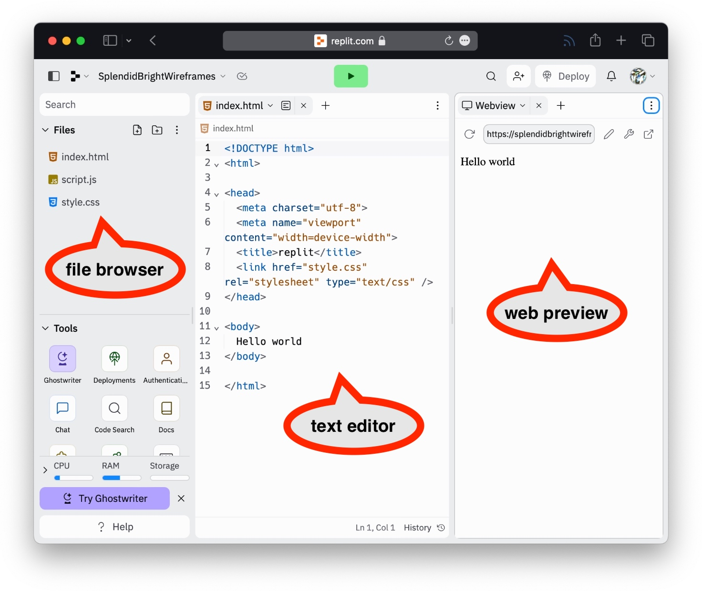

# Using Replit
[Replit](https://replit.com) is the code editor that we will be using this semester for all coding exercises and assignments. It is a browser-based IDE (Integrated Development Environment), which means that all HTML/CSS/JS editing, debugging, and previewing will be done within your web browser. *You will be sent an invite link to create your Replit account during the first day of class. All of the instructions below assume that you are logged in to Replit using your class account.*

 
  <figure style="width: 100%;">
	
	<figcaption style="font-style: italic; text-align: center;">Replit home page (when logged in)</figcaption>
  </figure>

## Creating a New Repl
Each individual project in Replit is called a "Repl".  To create a new Repl for practice or in-class exercises, simply go to the [IMS322 template](https://replit.com/@sheffie/IMS322-Template) and click the "Fork" button. Enter a new name for the Repl when prompted. This will create a new copy of the template in your account, which includes a customized `index.html` file and the `ims322-style.css` file (more on that [here](css/css-framework)).

If for some reason you want to make a fresh Repl without any of the customizations in the IMS322 template, click the "Create Repl" button in the upper-left corner of the Replit home page. When prompted, choose the "HTML, CSS, JS" template and enter a title.

You can find all personal Repls in the "My Repls" category in the lefthand sidebar on your Replit home page. *Note that these are public, meaning that technically anyone can see them if given a link.*
## The Replit Workspace
A typical Replit workspace setup consists of 3 main parts:
- The **file browser**, where HTML, CSS, JavaScript, and any other files in your Repl (e.g. images) are found. Creating new files and folders and uploading files to Replit from your computer also happens here.
- The **text editor**, where you can see and edit the code in your HTML, CSS, and JavaScript files. It is possible to have multiple files open in different tabs within the editor pane.
- The **web preview** section (aka "Webview"), where you can see a small rendered preview of your project. Clicking the big green "Run" button will refresh this preview to include your latest edits.

By default, these sections will load in the orientation seen in the screenshot below, from left to right. However, it is possible to rearrange or close some sections. For example, notice that the Webview tab has an X - clicking it will close that pane, leaving only the file browser and text editor. If this happens, you can always add a pane by clicking on the 3-dot menu button in the upper-right corner.

Two other important features of the workspace to note at this time:
- The **console**, which can be opened by clicking the wrench icon near the top of the Webview pane.
- **"Open in a new tab"**, which is the button to the right of the wrench. This opens the web preview in a full-sized window.

We will discuss the use of these features during the first few weeks of class. In the meantime, if you would like more information or a review of the Replit workspace, visit the [Introduction to the Workspace](https://docs.replit.com/programming-ide/introduction-to-the-workspace) page.

 
  <figure style="width: 100%;">
	
	<figcaption style="font-style: italic; text-align: center;">Replit editor (typical layout)</figcaption>
  </figure>

## Accepting and Submitting Assignments
When your Replit account is created, you will be added to the class "Team". You can see the projects assigned to your Team by clicking on "Teams" in the lefthand sidebar on your Replit home page.

In Team view, you will see a list of all coding assignments and their due dates. To accept an assignment, click on "Start project" to the right of the assignment's name. *Note that these Repls belong to your Team and are only visible here. They are also private, meaning that only the instructor, group members, and invited users can see them.*

Each assignment will be built from the [IMS 322 template](https://replit.com/@sheffie/IMS322-Template) and include instructions and possibly comments or example code within the HTML, CSS, and/or JavaScript files. The Instructions tab should open automatically when you open an assignment Repl. If you ever lose it, you can always bring it back by adding a tab to the left-hand or right-hand pane and setting the tab view to "Instructions". *Make sure that you carefully read all comments and instructions before beginning.*

When you finish working on an assignment, click the "Submit" button in the Repl workspace. This will timestamp your submission. You are welcome to go back and make changes after your initial submission, but keep in mind that resubmitting will change the timestamp, which may make the difference between submitting an assignment on time or late.

 
  <figure style="width: 100%;">
	
	<figcaption style="font-style: italic; text-align: center;">Replit Team page</figcaption>
  </figure>

## Embedded Examples
In many pages on this site, you will see embedded examples from Replit. These are like miniature "read-only" versions of the workspace - you can see the files, code, and preview, but not make changes. If you would like to try changing some of the code in these examples or make a copy for yourself, just click the "Open on Replit" button. This is god practice - try it out below! *Click the big play button if the preview is not visible.*
<iframe src="https://replit.com/@sheffie/IMS322-Embed-Example?embed=true" width="100%" height="480" style="border: none; border-radius: 8px; box-shadow: 0 1px 3px rgba(0,0,0,0.12), 0 1px 2px rgba(0,0,0,0.24);"></iframe>